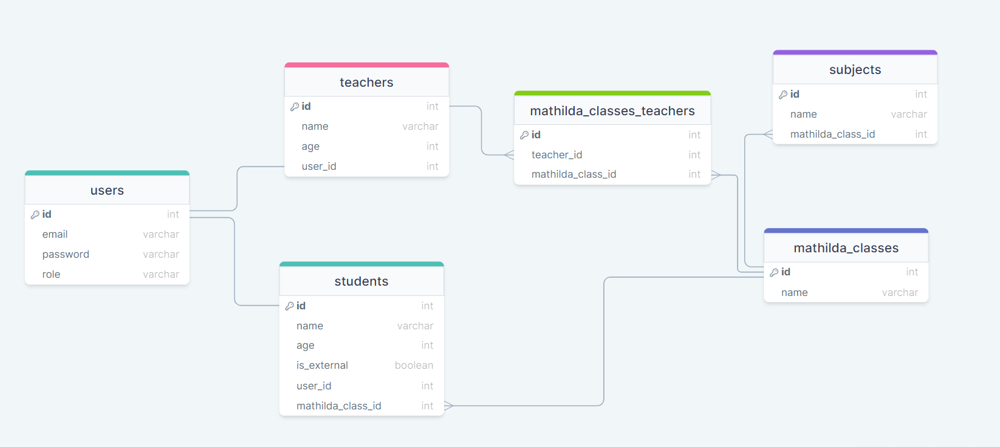

<div align="center">
  <h1>Mathilda Management</h1>
</div>

<!-- TABLE OF CONTENTS -->

# 📗 Table of Contents

- [📖 About the Project](#about-project)
  - [🛠 Built With](#built-with)
    - [Tech Stack](#tech-stack)
    - [Key Features](#key-features)
  - [🚀 Live Demo](#live-demo)
  - [ ERD Diagram](#erd-diagram)
  - [ API Documentation ](#api-doc)
- [💻 Getting Started](#getting-started)
  - [Setup](#setup)
  - [Prerequisites](#prerequisites)
  - [Install](#install)
  - [Usage](#usage)
  - [Deployment](#deployment)
- [👥 Authors](#authors)
- [🔭 Future Features](#future-features)
- [🤝 Contributing](#contributing)
- [⭐️ Show your support](#support)
- [🙏 Acknowledgements](#acknowledgements)
- [📝 License](#license)

<!-- PROJECT DESCRIPTION -->

# 📖 Mathilda management <a name="about-project"></a>

**Mathilda management** is the technical assessment given to me by mathilda®.

=> [Here is the mathilda management frontend](https://github.com/K0ppai/mathilda-management-frontend)

## 🛠 Built With <a name="built-with"></a>

### Tech Stack <a name="tech-stack"></a>

<details>
  <summary>Server</summary>
  <ul>
    <li><a href="https://rubyonrails.org/">Ruby on Rails</a></li>
  </ul>
</details>

<details>
<summary>Database</summary>
  <ul>
    <li><a href="https://www.postgresql.org/">PostgreSQL</a></li>
  </ul>
</details>

<!-- Features -->

### Key Features <a name="key-features"></a>

- Teachers and students are identified by their email addresses.
- Each teacher can teach multiple subjects across multiple classes.
- A class can consists of 2 types of students, internal and external.
- External students’ details are retrieved from an external system.
- The external system will only update external student details at 12:00 am daily.

<p align="right">(<a href="#readme-top">back to top</a>)</p>

<!-- GETTING STARTED -->

## 🚀 Live Demo <a name="live-demo"></a>

- Live demo coming soon.

## ERD Diagram <a name="erd-diagram"></a>



<p align="right">(<a href="#readme-top">back to top</a>)</p>

##  API Documentation <a name="api-doc"></a>

- [API Documentation](https://mathilda-management-6d5c387a84e7.herokuapp.com/api-docs/index.html)

## 💻 Getting Started <a name="getting-started"></a>

To get a local copy up and running, follow these steps.

### Prerequisites

In order to run this project you need:

- `Ruby`
- `Rails`
- `PostgreSQL`
- `Code editor (VSCode)`

### Setup

Clone this repository to your desired folder:

```sh
  git clone https://github.com/K0ppai/mathilda-management
```

### Install

Install this project run these commands in order:

```sh
  cd mathilda-management
  bundle install
  rails db:create
  rails db:migrate
```

### Usage

To run the project, execute the following command:

```sh
  rails server
```

<p align="right">(<a href="#readme-top">back to top</a>)</p>

<!-- AUTHORS -->

## 👥 Authors <a name="authors"></a>

👤 **Paing Soe Thu**

- GitHub: [@K0ppai](https://github.com/K0ppai)
- Twitter: [@_koppai_](https://twitter.com/_koppai_)
- LinkedIn: [LinkedIn](https://www.linkedin.com/in/paingsoe-thu)

<p align="right">(<a href="#readme-top">back to top</a>)</p>

<!-- FUTURE FEATURES -->

## 🔭 Future Features <a name="future-features"></a>

- **Deploy live version**
- **Implement delete features**

<p align="right">(<a href="#readme-top">back to top</a>)</p>

<!-- CONTRIBUTING -->

## 🤝 Contributing <a name="contributing"></a>

Contributions, issues, and feature requests are welcome!

Feel free to check the [issues page](https://github.com/K0ppai/mathilda-management/issues).

<p align="right">(<a href="#readme-top">back to top</a>)</p>

<!-- SUPPORT -->

## ⭐️ Show your support <a name="support"></a>

If you like this project, don't forget to give it a ⭐️. 😉

<p align="right">(<a href="#readme-top">back to top</a>)</p>

<!-- ACKNOWLEDGEMENTS -->

## 🙏 Acknowledgments <a name="acknowledgements"></a>

I would like to thank [mathilda®](https://mathilda.io/content/home) for this amazing opportunity.

<p align="right">(<a href="#readme-top">back to top</a>)</p>

<!-- LICENSE -->

## 📝 License <a name="license"></a>

This project is [MIT](./LICENSE) licensed.

<p align="right">(<a href="#readme-top">back to top</a>)</p>
